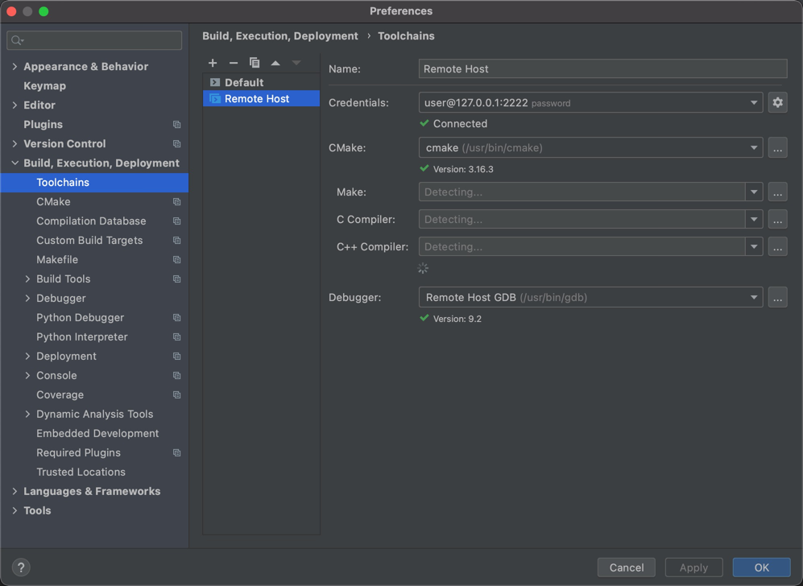
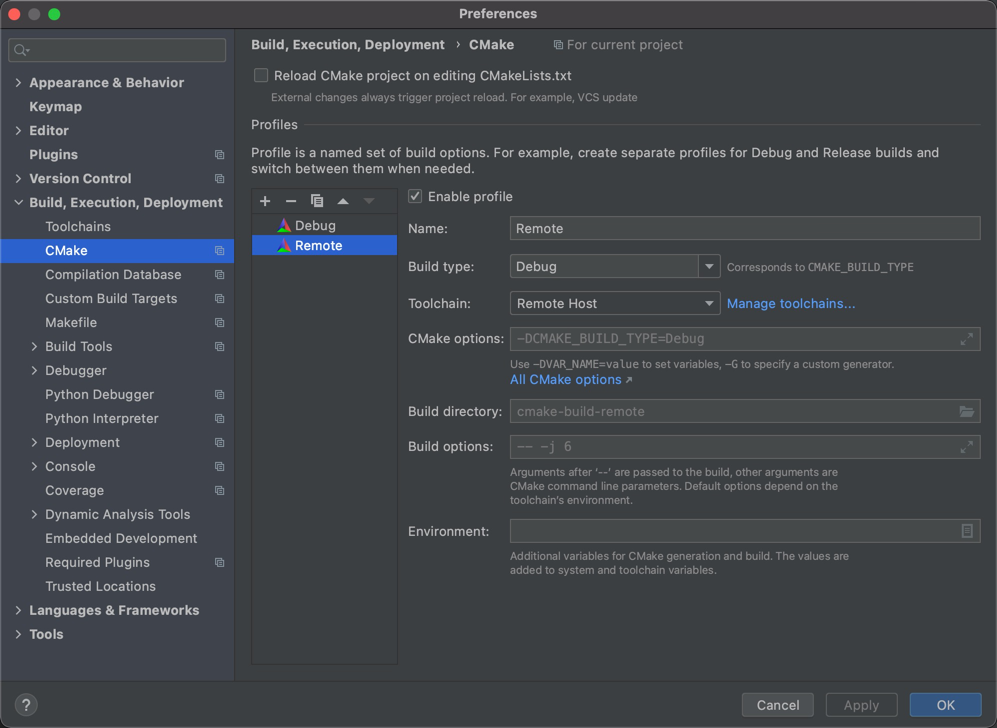

## TCP UDP SERVER

### TCP

#### 单客户端简单实现

* server.c
* tcp_server.c

#### 多客户端实现

##### 多进程(fork)

* sever_muti_fork.c

##### 非阻塞(fcntl)

* sever_muti_nblock.c

##### SELECT 机制

* sever_muti_select.c

##### EPOLL 机制(Linux Only)

* sever_muti_epoll_lt.c
* sever_muti_epoll_et.c

##### Kqueue 机制(macOS Only)

* sever_muti_kqueue.c

### 在docker 上进行 idea remote调试

> 某些场景下，有些lib仅仅是Linux支持的，需要在Linux上运行或者debug

#### 支持gcc，rsync等指令的docker创建

[创建测试容器](https://blog.jetbrains.com/clion/2020/01/using-docker-with-clion/#getting-docker)

```shell
 docker build -t clion/remote-c-env:1.1 -f Dockerfile .
 docker run -it -d --cap-add sys_ptrace -p127.0.0.1:2222:22 --name clion_remote_env clion/remote-c-env:1.1
 ssh-keygen -f "$HOME/.ssh/known_hosts" -R "[localhost]:2222"
```

#### 配置CLion Remote Env

[CLion Remote Run/Debug](https://www.jetbrains.com/help/clion/remote-projects-support.html#WorkWithRemote)


